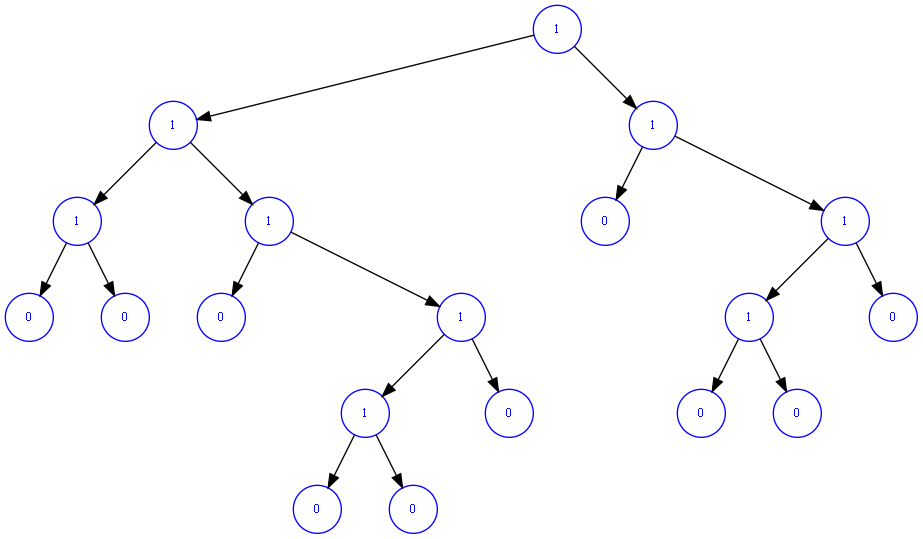

1. 因为r等概率地取到1到n中的值,故平均插入次数为
$$N = \frac{1 + 2 + ... + n}{n} = \frac{n + 1}{2} $$
即平均时间复杂度为$O(n)$

2. D

3. A

4. D

5. parent[] : -1 5 5 7 0 4 5 0 0 7

6. 重平衡过程中，重平衡的那条链上的节点的高度都可能发生改变
平均情况下，高度发生改变的节点个数约为 $O(x)$

7. 



8. 
(1).
```cpp
#include <iostream>
struct node
{
    intitem;
    node *next;
    node(int x, node *t)
    {
        item = x;
        next = t;
    }
};
typedef node *link;
int main(int argc, char const *argv[])
{
    int i, N = atoi(argv[1]), M = atoi(argv[2]);
    link t = new node(1, 0);
    t->next = t;
    link x = t;
    for (i = 2; i <= N; i++)
    { 
        // construct the circular list
        link tmp = new node(i, t);
        x->next = tmp;
        x = tmp;
    }
    
    while(x !=x->next){
        // game start
        for (int k = 0; k < M - 1; k++)
        {
            x = x->next;
        }
        link tmp = x->next;
        x->next = tmp->next;
        delete tmp;
    }
    std::cout << x->item << std::endl;
}
```
(2)
上述方法的复杂度为 $O(MN)$
使用数组的复杂度为 $ O(N ^ 2) $
谁能抢到取决于 M 和 N 的相对大小