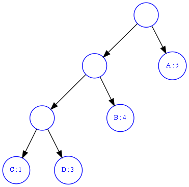

1. a
2. n-1
3. n
4. 设高度为h的平衡二叉树的最少节点数为 T(h)
    易知 T(0) = 1, T(1) = 2且 T(h) = T(0) + T(1) + T(2) + ... + T(h - 2) + h + 1 (h > 1)
    可得 T(h + 1) = T(h) + T(h - 1) + 1 (h > 0) 
    解得 $T(h) = ((1 + \frac{2}{\sqrt{5}}) (\frac{1 + \sqrt{5}}{2})^{h}) + (1 - \frac{2}{\sqrt{5}}) (\frac{1 - \sqrt{5}}{2})^{h}) - 1 $
5. 3
6. B
7. B
8. b c
9. B
10. (0, 3, 1) (3, 5, 4) (5, 2, 2) (3, 1, 5) (1, 4, 3)
11. 
A: 错误，无向图的邻接矩阵一定是对称的，因为其每一条边连接的两个点在邻接矩阵中是对称的，而边一致有向图的邻接矩阵不一定是不对称的，只要每条边都有一条对应的反向的边，则邻接矩阵也是对称的
B: 错误，需要该无向图是连通的
C: 正确，设T，T’为G的俩个最小生成树，设T的边集$ E(T)={e_1,e_2,...,e_m} $，4T'的边集$E(T')={e'_1,e'_2,...,e'_m}$。设$e_k$满足$e_k≠e'_k$且k最小，由于所有边权值不同，不妨假设$weight(e_k) < weight(e'_k)$，则将$e_k$加入到T'，T'中构成环，易知环中不包含$e'_1,e'_2,...,e'_{k-1}$(否则在T中有包含$e_k$的环)，将环中任意非$e_k$边删掉后得到了权值更小的生成树，这与T'为最小生成树相矛盾，故G最小生成树唯一。
12. 
a. ADCBABABDABDA
b.
    
    WPL = 1 * 5 + 2 * 4 + 3 * 3 + 3 * 1 = 25