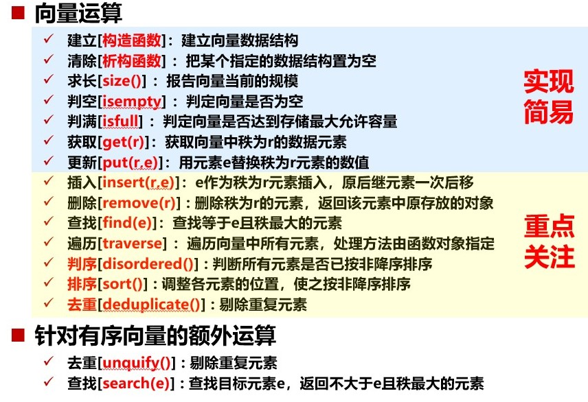
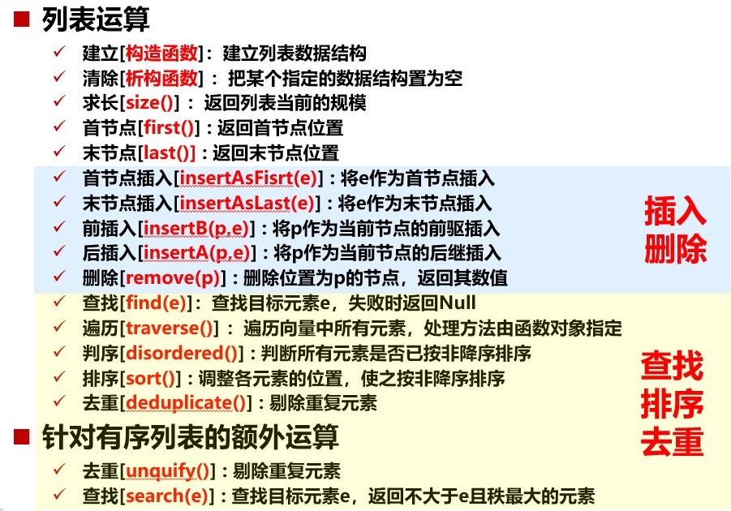
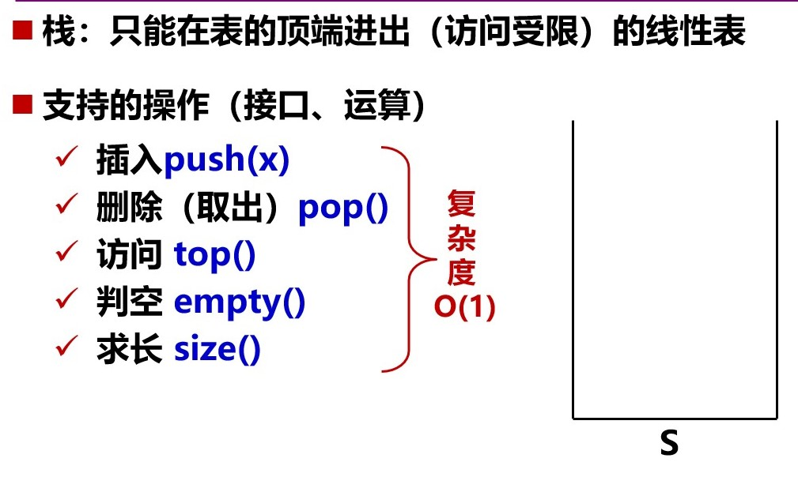
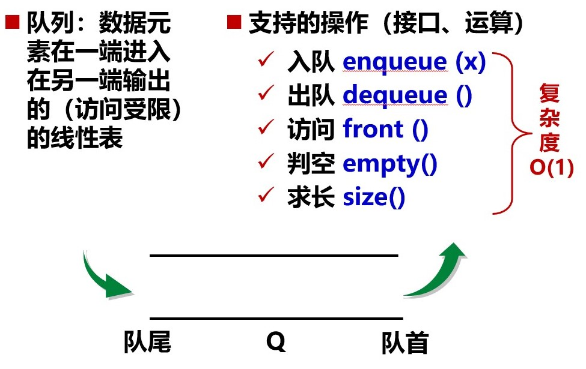

### 数据结构
### 数据的逻辑结构和存储结构
逻辑结构：集合 线性 树形 图形
存储结构：顺序 链式


### 线性结构

### 数组 -> 可变长数组 vector
* 操作复杂度：

*  特点:
```
动态管理数组长度 -> 替代普通的array
```
*  缺点：
```
内存需要连续开辟，不适合离散型数据的存储 -> map
```
* 应用
```
```

### 链表 link list
* 操作复杂度:


*  特点:
```
插入和删除快速 无需移动原来元素
```
* 缺点
```
查询慢
```
* 应用
```
```


### stack
* 操作复杂度:

*  特点:
```
first in last out
```
* 应用
```
暂存历史 逆序输出
递归嵌套
栈式计算
试探回溯
```
* 卡特兰数：$ h (n) =  \frac{(2n) !}{(n + 1)! \  n !}$
$ h (1) = 1, h(2) = 2, h(3) = 5, h(4) = 14  $


### queue
* 操作复杂度:

*  特点:
```
first in first out
```
* 应用
```
离散事件模拟
```
### binary tree
* 操作复杂度:
```
建立：O()
清除：O()
求长：O()
判空：O()
判满：无
获取：O()
更新：O()
插入：O()
删除：O()
查找：O()
遍历：O()
```
*  特点:
*  特点:
性质1：若二叉树节点的层次从 0 开始, 则在二叉树的第 i 层最多有$2 ^ i$ 个节点。( i≥0)
性质2：深度为 k 的二叉树最少有 k+1 个节点，最多有$2 ^ {k + 1} - 1$个节点。( k≥0 )
性质3：对任一棵二叉树，若出度为 2 的节点有$n _ 2$ 个,   则其叶节点个数 $n _ 0$满足
    $$n _ 0＝n_2＋1$$

树的性质：树中节点数 = 总出度数 +1
$$N = 1 + n _ 1 + 2 * n _ 2 + ... + K * n _ k$$
* 应用
```
多叉树转二叉树 森林转二叉树
二叉树遍历： 广度优先 深度优先 ：前序 中序 后序， 二叉树的重排
Huffman树
```

### Binary Search Tree
* 操作复杂度:
```
建立：O()
清除：O()
求长：O()
判空：O()
判满：无
获取：O()
更新：O()
插入：O()
删除：O()
查找：O(h)
遍历：O()
```
* 特点
不唯一 -> 平衡二叉树（旋转）
节点A的高度：（高度-> 到下面的距离）
从A到A的叶子节点中所经过的边数最大值
节点A的深度：（深度-> 到根的距离）
从根到A所经过的边数


* 应用
```
（递归实现）
搜索
插入 -> 构建
删除（分类）
```

### Balanced Binary Searching Tree : AVL tree
* 操作复杂度:
```
建立：O()
清除：O()
求长：O()
判空：O()
判满：无
获取：O()
更新：O()
插入：O()
删除：O()
查找：O()
遍历：O()
```
*  特点:
    * 删除节点：
    删除点的父节点就可能出现非平衡情况
    在某子树调整完后，需要迭代地从下往上检查该子树的祖先，如发现新的非平衡子树，则迭代调整
    * 插入节点：
    新插入点x后，非平衡子树UT(x)都是x的祖先，高度不低于x的祖父
    从x或x的父亲回溯，到达首个非平衡节点，记为g（祖父）
    p和v的高度必然大于等于其兄弟节点，因此可通过tallerChild找到孩子中高度大的作为p(父亲)和v

* 应用
```
```

### B-tree
* 操作复杂度:
```
建立：O()
清除：O()
求长：O()
判空：O()
判满：无
获取：O()
更新：O()
插入：O()
删除：O()
查找：O()
遍历：O()
```
*  特点:
    * 所有叶节点深度相同，根结点至少有两个分支
    * 除叶子节点外，节点的分支数（度数）比关键码个数多1
    * m限制节点的分支数可能，根据节点的分支数允许范围[⌈𝒎/𝟐⌉, 𝒎]命名B-树，如(2,3)树，(2,4)树
    * 最底层叶子节点的分支总数（紫色键）比树的关键码总数N多1
* 应用
```
```

### Red-Black tree
* 操作复杂度:
```
建立：O()
清除：O()
求长：O()
判空：O()
判满：无
获取：O()
更新：O()
插入：O()
删除：O()
查找：O()
遍历：O()
```
*  特点:
黑深度：除去根节点，沿途所经过黑节点（包括外部节点）总数称为该节点黑深度；根节点黑深度为0
黑高度：除去外部节点，沿途所经过黑节点总数称为该节点黑高度；外部节点黑高度为0，根节点黑高度为全树黑高度
* 应用
```
```

### Kd-treed
* 操作复杂度:
```
建立：O()
清除：O()
求长：O()
判空：O()
判满：无
获取：O()
更新：O()
插入：O()
删除：O()
查找：O()
遍历：O()
```
*  特点:
建树 O(nlogn)
范围查询 $ O(n ^ {\frac{k - 1}{k}} + m))$
最近邻查询 O()
* 应用
```

```


### map
* 操作复杂度：
```
建立：O()
清除：O()
求长：O()
判空：O()
判满：
获取：O()
更新：O()
插入：O()
删除：O()
查找：O()
遍历：O()
```
* 应用
```

```
### heap 堆(一种完全二叉树)
* 操作复杂度:
```
建立：O()
清除：O()
求长：O()
判空：O()
判满：无
获取：O()
更新：O()
插入：O()
删除：O()
查找：O()
遍历：O()
```
*  特点:
```
```
* 应用
```
优先队列
```

### 线段树 segment tree
* 操作复杂度:
```
建立：O(n)
清除：O()
求长：O()
判空：O()
判满：无
获取：O()
更新：O()
插入：O()
删除：O()
查找：O()
遍历：O()
```
*  特点:
```
建立 O(n)
维护区间修改 和 区间询问 O(log(n))
```
* 应用
```
递归逻辑应该先递归，再思考终止条件
建树：递归
pushdown: 更新子节点内容和tag,恢复父节点tag
询问：下发tag, 递归
区间加法：递归，更新内容，添加Lazytag，回溯更新父节点内容
区间乘法：注意顺序
```

### priority queue
* 操作复杂度:
```
建立：O()
清除：O()
求长：O()
判空：O()
判满：无
获取：O()
更新：O()
插入：O()
删除：O()
查找：O()
遍历：O()
```
*  特点:
```
```
* 应用
```
```

### Binary Index tree 树状数组
* 操作复杂度:
```
建立：O()
清除：O()
求长：O()
判空：O()
判满：无
获取：O()
更新：O()
插入：O()
删除：O()
查找：O()
遍历：O()
```
*  特点:
```
```
* 应用
```
建立复杂度O()
单点修改 区间查询(要具有区间可加性) 或 区间修改+单点查询(运用差分：区间修改->单点修改 单点查询->区间查询) (O(logn))
```


### 
* 操作复杂度:
```
建立：O()
清除：O()
求长：O()
判空：O()
判满：无
获取：O()
更新：O()
插入：O()
删除：O()
查找：O()
遍历：O()
```
*  特点:
```
```
* 应用
```
```

### 
* 操作复杂度:
```
建立：O()
清除：O()
求长：O()
判空：O()
判满：无
获取：O()
更新：O()
插入：O()
删除：O()
查找：O()
遍历：O()
```
*  特点:
```
```
* 应用
```
```


wait to learn
link cut tree 动态树
treap 树堆 fhq treap  AVL tree
tree red black tree
bst 二叉平衡树
splay treaplay