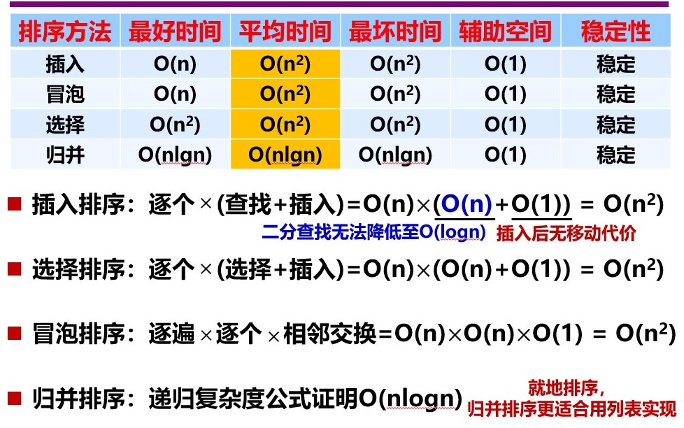

### 排序
* 内部排序
    * 插入排序
        * 插入排序 (从前往后，依次将元素放于前方有序序列的适合位置)
        * 希尔排序
    * 选择排序
        * 选择排序 (每次将最小者放于最前方) (不稳定!可能在放置某个最小元的时候破坏了其他相等元的顺序)
        * 堆排序
    * 交换排序
        * 冒泡排序 (比较相邻元素，使其符合大小关系)
        * 快速排序
    * 归并排序 (分治)
    * 桶排序
    * 基数排序 ()
* 外部排序

### 查找
* 顺序查找
* 二分查找
* 二叉树查找
* 分块查找
* 哈希查找

vector 实现

linked list 实现

